# State Wise

An automated trading decision system that combined a self-updating predicting model,
real-time market regime detection, and a deterministic risk-control layer to decide when,
wether, and how much to trade.

---

## The Problem that State Wise solves

Most algorithmic trading systems fail in one of two ways:

1. **Predictive models degrade silently.** A model trained on historical pattern assumes those pattern keep working. Markets shift between trading, ranging, and volatile conditions, and a static model doesn't know when it's own signal has stopped being reliable.

2. **Risk control is an afterthough.** Many systems bolt risk checks onto the excution layer later in development, or worse, let the predictive model itself decide position sizing, meaning a bad or overconfident signal can direcly translate into an oversize, unchecked trade.

## How it works



1. **Market data**: Normalized OHLCV data, live-streamed or historical.
2. **Feature engineering**: Computes separate feature sets for the predictor and the regime detector.
3. **Gradient boosting predictor**: Proposes a directional signal.
4. **HMM regime detector**: Estimates the current market regime.
5. **Risk engine**: The sole approval authority, rule-based, auditable, always has final veto.
6. **Position sizer**: Sizes apprived trades using signal confidence, regime, and volatility.
7. **Exit & portfolio monitor**: Manages exits, tracks drawdown, and can halt trading via a kill-switch (feeding back into the risk engine each cycle).

Full component-level docs live in [compoments](docs/components.md).

## State Wise's Architecture

```text
statewise/
├── config/            # risk rules, sizing params, exit thresholds (no redeploy needed to change)
├── docs/               # component docs, SRS, plan, account-control
├── src/statewise/
│   ├── data/           # market data ingestion (live + historical)
│   ├── features/       # feature engineering
│   ├── models/          # predictor + regime detector
│   ├── risk/            # risk engine
│   ├── sizing/           # position sizer
│   ├── exits/            # exit management
│   ├── monitoring/       # portfolio monitor, kill-switch
│   └── orchestration/    # TradingDecisionEngine
├── scripts/
└── tests/
```

## Getting started

### Install

```bash
pip install -r requirements.txt
```

### Quick test - live data ingestion

The fastest way to confirm that the setup works end to end is to run the live feed against Binance's testnet:

```bash
python -m statewise.data.liveFeed
```

This connects to the testnet WebSocket stream and prints incoming market date. No API key required for this step.
